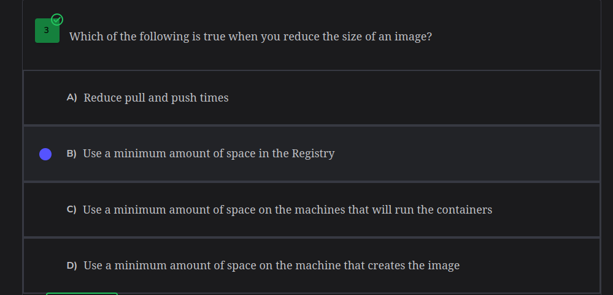
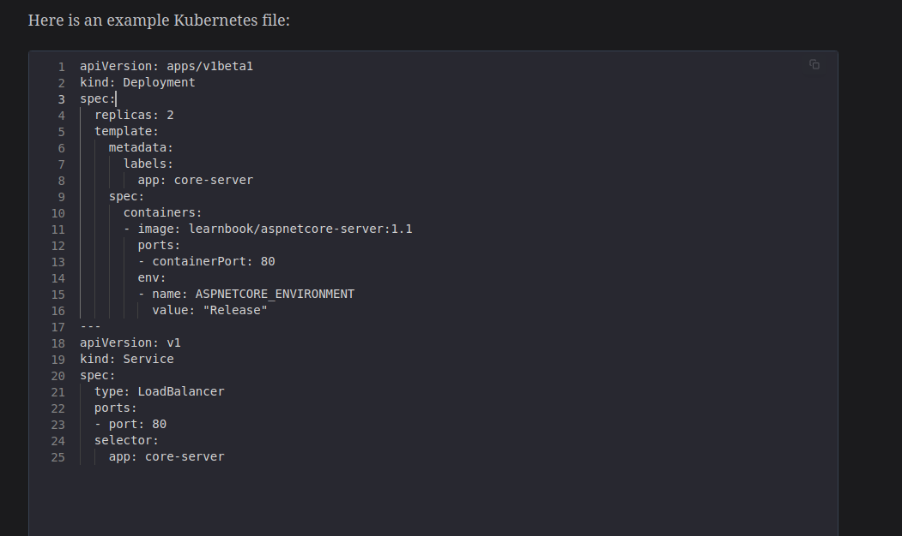

# Notes
A private registry allows you to pick and choose who would have access to your private images while a public registry gives allows everyone to access your private images
---

## A docker file is more like a file that contains code
---
It is executed sequentially while building the images

Important things to look at when building an image are:
	The order of the commands written
	size of the image

a) *Size of the image*
The size of the image of the container can be controlled using optimized solutions
	1) Using a slim or an alpine version of the image built from - to save on space (but it is to be used cautiously)
	2) Not including unnecessary files

---
b) *The order of the commands written*
Images being rebuilt often use caches to save on time during building:
	•Write the constant commands first (commands that won't change much during building or won't be affected by changes that much)
	•Variable commands come later (such as COPY; a new file might be added to the directory)
---

When creating a container, you may want it up and working even if the container host has been restarted thus increasing uptime

you may use **docker run -d -p 80 --restart always nginx**
*The problem with this is that it works too well when you try to stop the container using the stop cmd it will still run*

and thus is better if we used
**docker run -d -p 80 --restart unless-stopped nginx**

***Reclaiming Disk space***
Here are some commands to remove items that you don't need
*docker container prune -f*
*docker volume prune -f*
*docker images prune -f  (removes only thadangling images)*
*docker image prune --all (removes all images)*

orchestration tools are tools that make your life easier when it comes to maintaining containers which containers to run at a time how to delete containers how to remove images volumes and so much more examples of these orchestration tools are *docker swarm and kubernetes*

an example of kubernetes file

