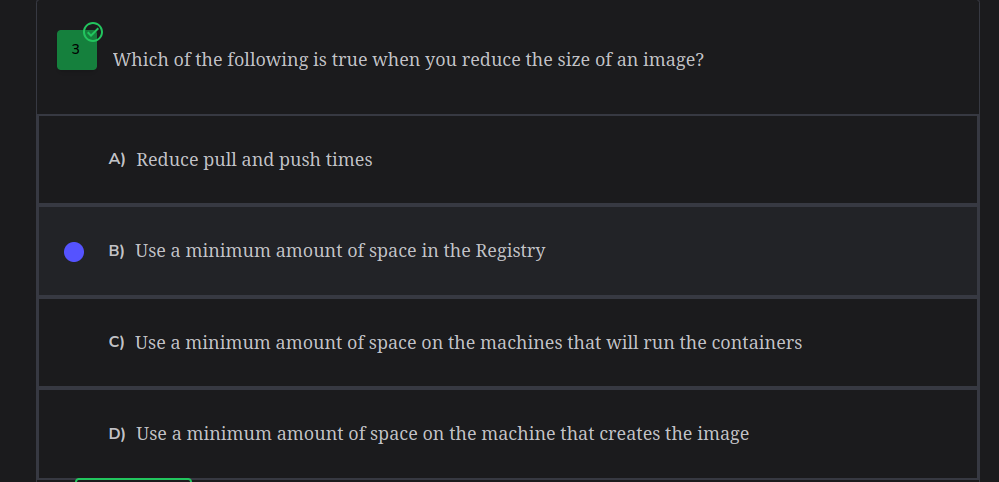

A docker file is more like a file that contains code
It is executed sequentially while building the images

Important things to look at when building an image are:
	The order of the commands written
	size of the image

a) *Size of the image*
The size of the image of the container can be controlled using optimized solutions
	1) Using a slim or an alpine version of the image built from - to save on space (but it is to be used cautiously)
	2) Not including unnecessary files

---
b) *The order of the commands written*
Images being rebuilt often use caches to save on time during building:
	•Write the constant commands first (commands that won't change much during building or won't be affected by changes that much)
	•Variable commands come later (such as COPY; a new file might be added to the directory)

