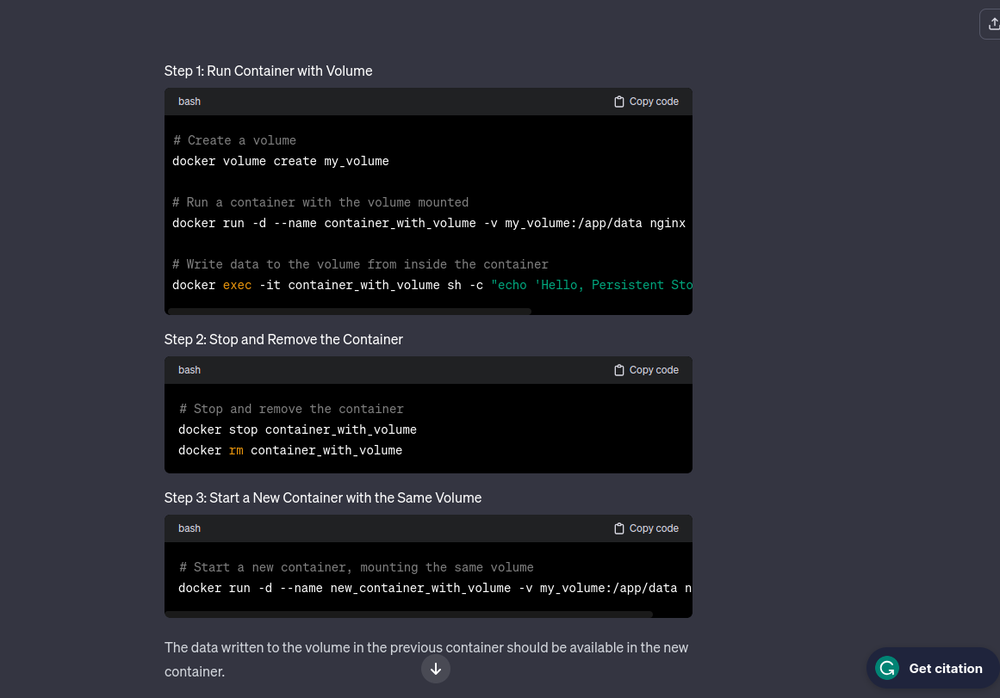

# Notes
A private registry allows you to pick and choose who would have access to your private images while a public registry gives allows everyone to access your private images
---

## A docker file is more like a file that contains code
---
It is executed sequentially while building the images

Important things to look at when building an image are:
	The order of the commands written
	size of the image

a) *Size of the image*
The size of the image of the container can be controlled using optimized solutions
	1) Using a slim or an alpine version of the image built from - to save on space (but it is to be used cautiously)
	2) Not including unnecessary files

---
b) *The order of the commands written*
Images being rebuilt often use caches to save on time during building:
	•Write the constant commands first (commands that won't change much during building or won't be affected by changes that much)
	•Variable commands come later (such as COPY; a new file might be added to the directory)
---

When creating a container, you may want it up and working even if the container host has been restarted thus increasing uptime

you may use **docker run -d -p 80 --restart always nginx**
*The problem with this is that it works too well when you try to stop the container using the stop cmd it will still run*

and thus is better if we used
**docker run -d -p 80 --restart unless-stopped nginx**

***Reclaiming Disk space***
Here are some commands to remove items that you don't need
*docker container prune -f*
*docker volume prune -f*
*docker images prune -f  (removes only thadangling images)*
*docker image prune --all (removes all images)*

orchestration tools are tools that make your life easier when it comes to maintaining containers which containers to run at a time how to delete containers how to remove images volumes and so much more examples of these orchestration tools are *docker swarm and kubernetes*

an example of kubernetes file

Docker containers can be connected using a network that you create yourself:
	it will act like two containers that are connected to a network as long as the container 
         has a name you can referrence it as url *http://container1* and it works. You can add the port if need be.

For persistent volume (if I always respawn a new container and I need some data to always appear there)

**Bind mounts**
So for bind mounts its a two way street changes made in the container files will also reflect in the host files and also changes made in the host files
		will also appear in the container files(*two way street*)

**overlay network**
Overlay network is a type of network for containers that allows them to communicate even if they are in different hosting machines

**docker content trust**

If a Docker image is tampered with and the tampered version is different from the one that was signed and published, Docker Content Trust (DCT) will prevent the pulled image from running. Here's how it works:

Image Tampering:

Let's say an attacker manages to tamper with the contents of a Docker image after it has been signed and published. This could involve modifying the files, adding malicious code, or making any unauthorized changes.
Signature Verification:

When a user or system attempts to pull the tampered image, Docker Content Trust checks for the presence of a valid signature and retrieves the corresponding public key.
Invalid Signature:

If the tampered image does not match the signature created with the private key during the signing process, the digital signature verification will fail.
Preventing Execution:

In the case of a failed signature verification, Docker Content Trust prevents the pulled image from being executed. It considers the image compromised or tampered with, and as a security measure, it refuses to run the container.
Error Message:

The user attempting to pull the image will typically receive an error message indicating that the image's signature is invalid. The error message helps alert users to the potential security issue and prevents the use of a compromised image.
By preventing the execution of containers with tampered images, DCT helps maintain the integrity of the containerized environment and reduces the risk of running malicious or unauthorized code. This security feature is especially critical in production environments where the trustworthiness of container images is paramount.
